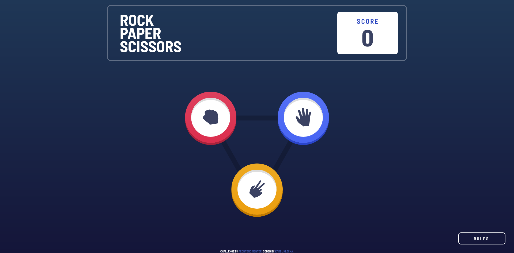

# Frontend Mentor - Rock, Paper, Scissors solution

This is a solution to the [Rock, Paper, Scissors challenge on Frontend Mentor](https://www.frontendmentor.io/challenges/rock-paper-scissors-game-pTgwgvgH). Frontend Mentor challenges help you improve your coding skills by building realistic projects. 

## Table of contents

- [Frontend Mentor - Rock, Paper, Scissors solution](#frontend-mentor---rock-paper-scissors-solution)
  - [Table of contents](#table-of-contents)
  - [Overview](#overview)
    - [The challenge](#the-challenge)
    - [Screenshot](#screenshot)
    - [Links](#links)
  - [My process](#my-process)
    - [Built with](#built-with)
    - [What I learned](#what-i-learned)
    - [Continued development](#continued-development)
    - [Useful resources](#useful-resources)
  - [Author](#author)

## Overview

### The challenge

Users should be able to:

- View the optimal layout for the game depending on their device's screen size
- Play Rock, Paper, Scissors against the computer
- Maintain the state of the score after refreshing the browser _(optional)_
- **Bonus**: Play Rock, Paper, Scissors, Lizard, Spock against the computer _(optional)_

### Screenshot



### Links

- Solution URL: [Add solution URL here](https://your-solution-url.com)
- Live Site URL: [https://rock-paper-scissors-klekar.vercel.app](https://rock-paper-scissors-klekar.vercel.app)

## My process

### Built with

- HTML
- CSS with LESS
- JavaScript

### What I learned

I've learned that for good performance of CSS animations I cannot use properties that change layout of elements. For example instead of this:
````css
@keyframes game-result-widen {

    0% {
        width: clamp(22.5em, 60vw, 45em);
    }

    100% {
        width: clamp(30em, 80vw, 60em);
    }
}
````
I changed to this:
````css
@keyframes game-result-left-move-in {
    0% {
        transform: translateX(50%);
    }

    100% {}
}

@keyframes game-result-right-move-in {
    0% {
        transform: translateX(-50%);
    }

    100% {}
}
````

I used clip-path CSS property to create press-in button animation with inline SVG to make it scaleable.

````xml
  <svg width="0" height="0">
    <defs>
      <clipPath id="hole-cut" clipPathUnits="objectBoundingBox">
        <path d="M 0 0.5 A 0.25 0.25 90 1 1 1 0.5 L 1 0.54 A 0.25 0.25 90 1 1 0 0.54 L 0 0.5" />
      </clipPath>
    </defs>
  </svg>
````

Sadly, Firefox had some issue with animating children of element which is clipped by inline SVG. Therefore for Firefox I had to make CSS path, which doesn't scale so I made LESS mixin `.firefox-clip-path(@scale)` and put it in according selectors with according scale.

```less
.firefox-clip-path(@scale) {
    clip-path: e(%("path('M 0 %a A %a %a 90 1 1 %a %a L %a %a A %a %a 90 1 1 0 %a L 0 %a')",
                0.5 * @scale,
                0.25 * @scale,
                0.25 * @scale,
                1 * @scale,
                0.5 * @scale,
                1 * @scale,
                0.54 * @scale,
                0.25 * @scale,
                0.25 * @scale,
                0.54 * @scale,
                0.5 * @scale ));
}
```

### Continued development

App doesn't seem to be doing very well on mobile phones. Specifically mobile Safari appears to be just doing some wierd stuff and Samsung Internet ruined color gradient of rock paper scissors buttons. That is something I would like to look into in the future.
If I become aware of any further bugs I might fix them but otherwise I won't most likely develop this app any further since the bonus version is pretty much the same regarding coding.

### Useful resources

- [yqnn svg path editor](https://yqnn.github.io/svg-path-editor/) - I used this to create SVG hole shape for the buttons.

## Author

- Frontend Mentor - [@Klekar](https://www.frontendmentor.io/profile/Klekar)

